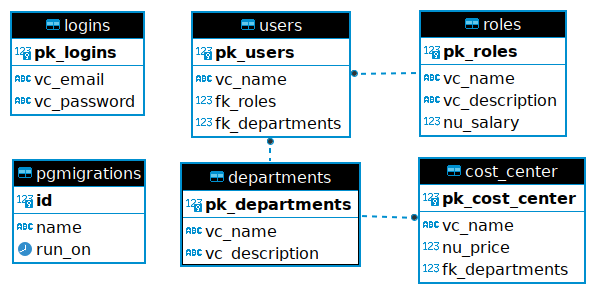

# CRUD Empresa

Sistema de CRUD Empresa feita em Node.js com framework Express.js usando o banco PostgreSQL.

Para comunicar com o banco foi usado as bibliotecas `pg` e `node-pg-migrate`.

# Diagrama ER

# Instruções

1. Baixar o repositório com os arquivos do projeto;
1. Executar o comando `npm i` para baixar as dependências;
1. Copiar o arquivo `.env.example` para `.env` e alterar as configurações;
1. Criar o database informado no `.env` dentro do PostgreSQL;
1. Rodar o comando `npm run migrate up` para realizar a migração;
1. Rodar o comando `node bin/app.js` para ficar disponível no `http://localhost:8081`.

Opcionalmente pode executar o arquivo `database-seed.sql` dentro do PostgreSQL para popular o database.
